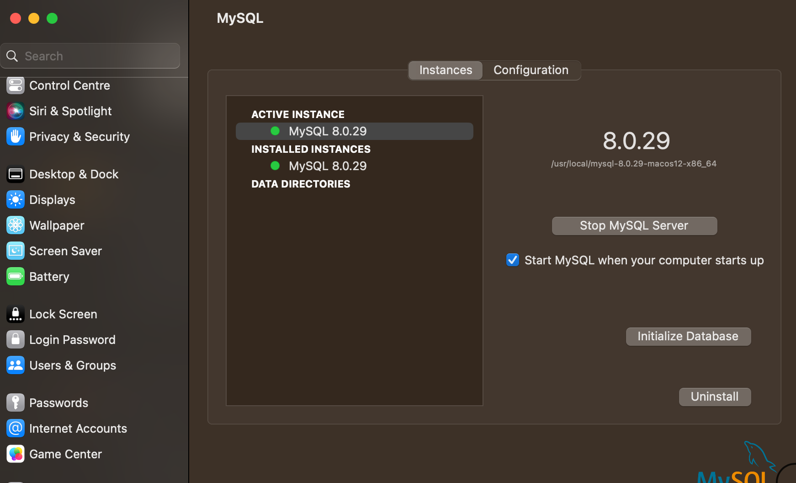

# 1. Uninstalling: MySQL server

## 1.1. MacOS: server

1. If you have databases: Use mysqldump to backup your databases to txt files.

2. Stop MySQL server:
   ` > System settings > at the bottom click on MySQL > click on stop`



3. Follow these commands on bash:

```bash
# Open a terminal window

sudo rm /usr/local/mysql
sudo rm -rf /usr/local/mysql*
sudo rm -rf /Library/StartupItems/MySQLCOM
sudo rm -rf /Library/PreferencePanes/My*
edit /etc/hostconfig and remove the line MYSQLCOM=-YES-
rm -rf ~/Library/PreferencePanes/My*
sudo rm -rf /Library/Receipts/mysql*
sudo rm -rf /Library/Receipts/MySQL*
sudo rm -rf /private/var/db/receipts/*mysql*
```

Some may not work. That's fine.

## 1.2. Windows: server

# 2. Uninstalling: Workbench

## 2.1. MacOS: workbench

1. Quit MySQL wortkbench
2. Drag it from your Application folder into the trashcan

## 2.2. Windows: workbench
