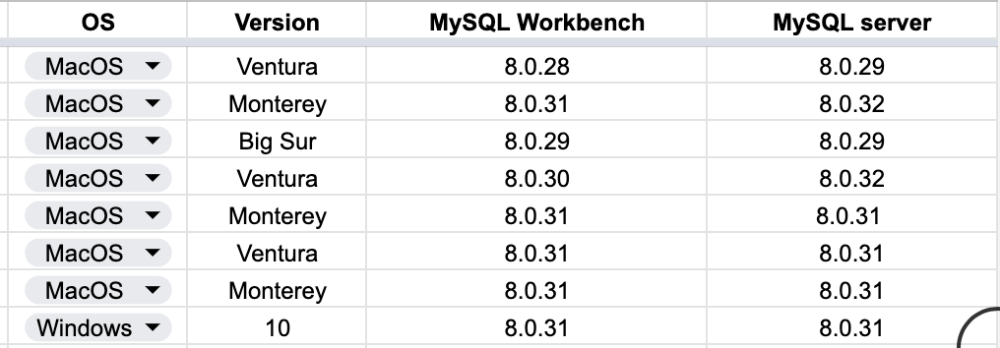

There's two components: the server (MySQL server) & the interface (MySQL workbench). Go into these website and download versions that work.

- 1. [MySQL SERVER](https://downloads.mysql.com/archives/community/)

- 2. [MySQL WORKBENCH](https://downloads.mysql.com/archives/workbench/)

These are some of the combinations for sure should work:

